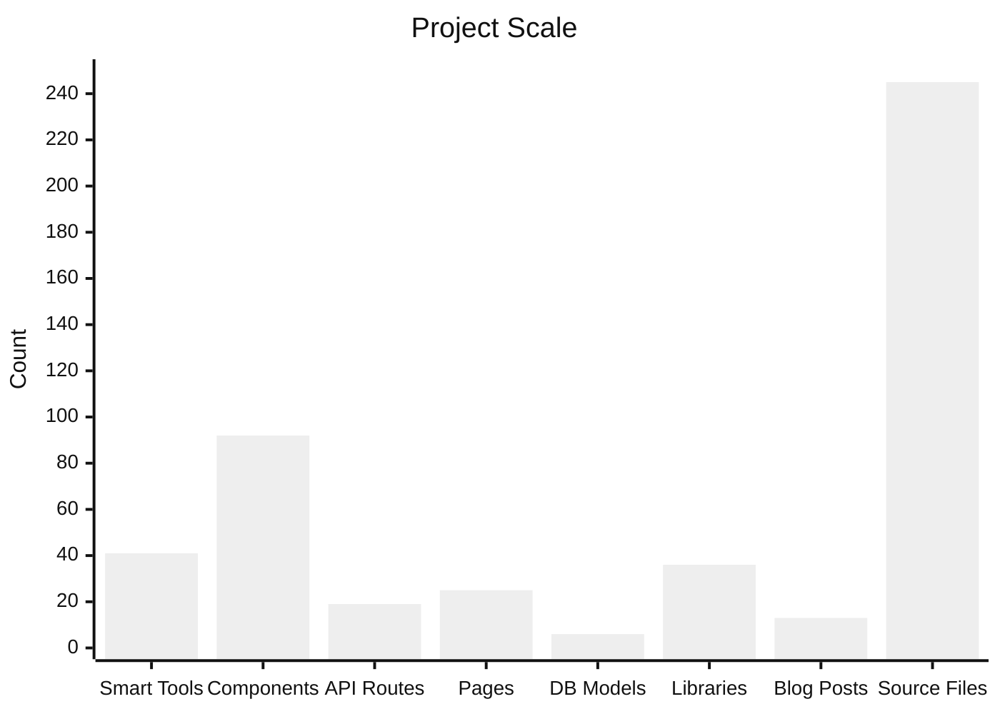
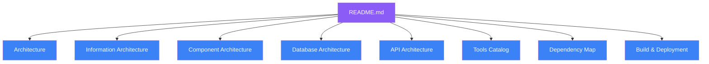

<p align="center">
  <picture>
    <source media="(prefers-color-scheme: dark)" srcset="https://img.shields.io/badge/ToolForge-8B5CF6?style=for-the-badge&logo=data:image/svg+xml;base64,PHN2ZyB4bWxucz0iaHR0cDovL3d3dy53My5vcmcvMjAwMC9zdmciIHdpZHRoPSIyNCIgaGVpZ2h0PSIyNCIgZmlsbD0ibm9uZSIgc3Ryb2tlPSJ3aGl0ZSIgc3Ryb2tlLXdpZHRoPSIyIiB2aWV3Qm94PSIwIDAgMjQgMjQiPjxwYXRoIGQ9Ik0xMiAyTDkgOUwxMiAxNUwxNSA5eiIvPjxwYXRoIGQ9Ik05IDlIMyIgb3BhY2l0eT0iMC42Ii8+PHBhdGggZD0iTTE1IDlIMjEiIG9wYWNpdHk9IjAuNiIvPjwvc3ZnPg==">
    
  </picture>
</p>

<p align="center">
  <strong>🚀 41 Privacy-First Online Tools — for Teachers, Students, Creators, Developers & Businesses</strong>
</p>

<p align="center">
  <a href="https://nextjs.org/"></a>
  <a href="https://react.dev/"></a>
  <a href="https://www.typescriptlang.org/"></a>
  <a href="https://www.prisma.io/"></a>
  <a href="https://tailwindcss.com/"></a>
  <a href="https://next-auth.js.org/"></a>
  <a href="https://zustand-demo.pmnd.rs/"></a>
  <br>
  <a href="https://vercel.com/"></a>
  <a href="https://opensource.org/licenses/MIT"></a>
  <a href="https://github.com/edwinwamukoya88-alt/smart-tools-kit"></a>
  <a href="https://github.com/edwinwamukoya88-alt/smart-tools-kit/issues"></a>
</p>

---

## 📋 Table of Contents

- [Screenshots](#-screenshots)
- [Features](#-features)
- [Project Statistics](#-project-statistics)
- [Quick Start](#-quick-start)
- [Roadmap](#-roadmap)
- [Documentation](#-documentation)
- [Tech Stack](#-tech-stack)
- [Deployment](#-deployment)
- [Contributing](#-contributing)
- [License](#-license)

---

## 📸 Screenshots

> **Note:** Replace these placeholder links with actual screenshots from your deployment.

| Page | Preview |
|------|---------|
| **Home Page** |  |
| **Tools Directory** |  |
| **Admin Dashboard** |  |
| **Blog Listing** |  |
| **Blog Article** |  |
| **Analytics Dashboard** |  |
| **Pomodoro Timer** |  |
| **Lesson Planner** |  |
| **Mobile View** |  |

> 💡 See [docs/images/README.md](docs/images/README.md) for screenshot guidelines.

---

## ✨ Features

### 🎯 Productivity

| Tool | Description | Storage |
|------|-------------|---------|
| **Task Planner** | Full-featured planner with calendar, filters, focus mode, reminders, and drag-and-drop | Zustand + localStorage |
| **Pomodoro Timer** | Focus timer with session analytics, gamification (XP/levels/achievements), and Zenith focus mode | localStorage |
| **Notes App** | Write and organize notes with local persistence | localStorage |
| **Day Planner** | Hour-by-hour daily planning | localStorage |
| **Habit Tracker** | Build streaks and track daily habits | localStorage |
| **Stopwatch** | Time tracking with lap recording | - |
| **Kanban Board** | Drag-and-drop task organization | localStorage |

### 📚 Education (CBC / KICD-Aligned)

| Tool | Description |
|------|-------------|
| **CBC Grade Calculator** | Compute scores and competency levels (EE/ME/AE/BE) per KICD standards |
| **Lesson Plan Generator** | 6-step wizard generating KICD-compliant plans with competencies, PCIs, assessments |
| **Revision Planner** | Curriculum-aligned skill-based practice and revision planning |
| **Exam Generator** | Performance-based assessments — projects, tasks, observations |
| **Teacher Comment Generator** | CBC-aligned competency-based feedback generation |
| **Scheme of Work Generator** | KICD schemes with inquiry questions and competencies |

### 🔒 Security & Text

Base64 encoder/decoder, password generator, URL encoder/decoder, text cleaner, random generator (UUIDs, numbers, names).

### 📱 QR & Connectivity

QR code generator, QR scanner (camera-based), QR extractor (image-based), URL shortener.

### 📄 File Conversion

PDF converter, image converter, document converter, audio converter (via FFmpeg), file compressor.

### 🛠 Developer Tools

JSON formatter/validator, regex tester with live matching, markdown preview, unit converter (length, weight, temperature, etc.).

### 🎨 Design & Creative

Color picker (HEX/RGB/HSL), Lorem Ipsum generator, favicon generator, image placeholder generator, **Design Cards Studio** (business cards, invitations, certificates, social media posts).

### 💰 Finance

Currency converter, loan calculator (EMI schedules), profit margin/ROI calculator, expense tracker.

### 📊 Analytics & Admin

| Feature | Description |
|---------|-------------|
| **Admin Dashboard** | Overview stats, quick actions, system health monitoring |
| **Analytics Dashboard** | 8 tabs: Overview, Traffic, Tools, Content, SEO, Users, Live, Insights |
| **Multi-Source Analytics** | GA4 + Search Console + First-Party (IndexedDB) |
| **Blog CMS** | MDX editor with drafts, SEO validation, auto-fix, GitHub publishing |
| **AI Content Studio** | 9 AI tools: blog generator, SEO optimizer, FAQ generator, schema generator, and more |
| **Ad Management** | Sponsored ad CRUD with impression/click tracking |
| **User Management** | Role-based admin access (admin, editor, viewer) |
| **Site Settings** | Editable homepage, SEO, branding, social links, footer |

### 📝 Blog

13 published posts covering productivity, education, technology, and more. Features include: cover image generator, table of contents, related articles/tools, share buttons, AI visibility scoring, pre-publish SEO validation, internal link graph.

---

## 📊 Project Statistics



| Metric | Count |
|--------|-------|
| 🔧 **Smart Tools** | 41 |
| 🧩 **React Components** | 92 |
| 🚏 **API Routes** | 19 |
| 📄 **Pages** | 25 (13 public + 12 admin) |
| 🗄️ **Database Models** | 6 |
| 🪝 **Custom Hooks** | 2 |
| 🔄 **Context Providers** | 2 |
| 📚 **Libraries (lib/)** | 36 |
| 📦 **Production Dependencies** | 31 |
| 🛠️ **Dev Dependencies** | 8 |
| 📝 **Blog Posts** | 13 |
| 🏗️ **Total Source Files** | 245 |
| 📏 **Lines of TypeScript/React** | ~38,500 |
| 📖 **Documentation Files** | 9 |
| 🗂️ **Tool Categories** | 8 |
| 🔄 **Database Migrations** | 1 |

---

## 🚀 Quick Start

### Prerequisites

- **Node.js** >= 18.x
- **npm** >= 9.x
- **Git** >= 2.x

### One-Minute Setup

```bash
# 1. Clone the repository
git clone <your-repo-url>
cd smart-tools-kit

# 2. Install dependencies
npm install

# 3. Copy environment file
cp .env.example .env.local

# 4. Generate Auth.js secret
npx auth secret

# 5. Start development server
npm run dev
```

Open [http://localhost:3000](http://localhost:3000) in your browser.

### Production Build

```bash
npm run build
npm start
```

---

## 🗺️ Roadmap

### ✅ Completed

| Feature | Status |
|---------|--------|
| 41 Client-Side Tools | ✅ |
| CBC/KICD Education Tools | ✅ |
| Admin Panel with Dashboard | ✅ |
| Blog CMS with MDX | ✅ |
| Google OAuth Authentication | ✅ |
| Multi-Source Analytics (GA4 + Search Console + First-Party) | ✅ |
| AI Content Studio | ✅ |
| Sponsored Ad Management | ✅ |
| SEO Validation & Auto-Fix | ✅ |
| API Route Architecture (19 endpoints) | ✅ |
| Prisma/SQLite Database (6 models) | ✅ |
| GitHub Blog Publishing | ✅ |
| Design Cards Studio | ✅ |
| Pomodoro Timer with Gamification | ✅ |
| Zustand State Management (Task Planner) | ✅ |

### 🚧 In Progress

| Feature | Status |
|---------|--------|
| AI Scoring & Content Optimization | 🔄 |
| Real-Time Analytics Live View | 🔄 |
| Universal Content Rewriter | 🔄 |

### 🔮 Future

| Feature | Description | Priority |
|---------|-------------|----------|
| **PWA Support** | Offline-capable progressive web app with service worker | 🔴 High |
| **Offline Mode** | Full tool functionality without internet connection | 🔴 High |
| **Team Collaboration** | Shared workspaces and real-time collaboration | 🟡 Medium |
| **AI Assistant** | Integrated AI chat for content generation and analysis | 🟡 Medium |
| **User Accounts** | Optional accounts for cross-device sync | 🟡 Medium |
| **Cloud Sync** | Encrypted cloud backup for tool data | 🟡 Medium |
| **Mobile App** | React Native or Tauri-based mobile application | 🟢 Low |
| **Plugin System** | Third-party tool plugin architecture | 🟢 Low |
| **Marketplace** | Community-contributed tool marketplace | 🟢 Low |
| **Multi-Language Support** | i18n for internationalization | 🟢 Low |
| **Dark/Light Theme** | User-selectable theme preference | 🟢 Low |
| **Browser Extension** | Quick-access browser extension | 🟢 Low |

---

## 📖 Documentation

### Architecture Overview



### Document Index

| # | Document | Description | Pages |
|---|----------|-------------|-------|
| 1 | [ARCHITECTURE.md](docs/ARCHITECTURE.md) | System architecture, tech stack, data flow, deployment, component hierarchy | Full |
| 2 | [PROJECT_STRUCTURE.md](docs/PROJECT_STRUCTURE.md) | Complete file tree of the entire project | All |
| 3 | [INFORMATION_ARCHITECTURE.md](docs/INFORMATION_ARCHITECTURE.md) | Website hierarchy, navigation, user journeys, content model | All |
| 4 | [COMPONENT_ARCHITECTURE.md](docs/COMPONENT_ARCHITECTURE.md) | Component library, dependencies, props, hierarchy | 91 components |
| 5 | [DATABASE_ARCHITECTURE.md](docs/DATABASE_ARCHITECTURE.md) | Prisma schema, 6 models, ERD, data access patterns | Full |
| 6 | [API_ARCHITECTURE.md](docs/API_ARCHITECTURE.md) | All 19 API routes, auth flow, request/response specs | Full |
| 7 | [TOOLS_CATALOG.md](docs/TOOLS_CATALOG.md) | Complete catalog of all 41 tools with descriptions and categories | 41 tools |
| 8 | [DEPENDENCY_MAP.md](docs/DEPENDENCY_MAP.md) | Internal/external dependency graph, module relationships | Full |
| 9 | [BUILD_AND_DEPLOYMENT.md](docs/BUILD_AND_DEPLOYMENT.md) | Build process, env vars, troubleshooting, Vercel deployment | Full |

---

## 🛠️ Tech Stack

| Category | Technology |
|----------|-----------|
| **Framework** | Next.js 16.2.9 (App Router) |
| **UI Library** | React 19.2.4, Tailwind CSS 4, Framer Motion 12 |
| **Language** | TypeScript (strict mode) |
| **Database** | SQLite via Prisma 7.8.0 + Better-SQLite3 |
| **Authentication** | Auth.js v5 (Google OAuth, JWT sessions) |
| **State Management** | Zustand 5.0.14 (Task Planner) |
| **Charts** | Recharts 3.8.1 |
| **Icons** | Lucide React 1.18 |
| **PDF Generation** | jsPDF 4.2.1 + jspdf-autotable |
| **Markdown** | react-markdown 10 + remark-gfm + rehype |
| **Notifications** | Sonner 2.0.7 |
| **Linting** | ESLint 9 + eslint-config-next |
| **Deployment** | Vercel |

---

## 🌐 Deployment

### Vercel (Recommended)

[](https://vercel.com/new)

### Required Environment Variables

| Variable | Description | Required |
|----------|-------------|----------|
| `DATABASE_URL` | SQLite database path (`file:./dev.db`) | ✅ Yes |
| `AUTH_SECRET` | Auth.js encryption secret | ✅ Yes |
| `AUTH_GOOGLE_ID` | Google OAuth client ID | ✅ Yes |
| `AUTH_GOOGLE_SECRET` | Google OAuth client secret | ✅ Yes |
| `AUTH_URL` | Deployment URL | ✅ Yes |
| `GA_CLIENT_EMAIL` | GA4 service account email | ❌ Optional |
| `GA_PRIVATE_KEY` | GA4 service account private key | ❌ Optional |
| `GA_PROPERTY_ID` | GA4 property ID | ❌ Optional |
| `GITHUB_TOKEN` | GitHub personal access token | ❌ Optional |
| `GITHUB_OWNER` | GitHub username/org | ❌ Optional |
| `GITHUB_REPO` | GitHub repository name | ❌ Optional |

> For detailed deployment instructions, see [BUILD_AND_DEPLOYMENT.md](docs/BUILD_AND_DEPLOYMENT.md).

---

## 🤝 Contributing

Contributions are welcome! Please follow these guidelines:

1. **Fork** the repository
2. **Create a feature branch** (`git checkout -b feature/amazing-feature`)
3. **Make your changes** (documentation, bug fixes, or new tools)
4. **Run lint** (`npm run lint`) — ensure 0 errors
5. **Build** (`npm run build`) — ensure it compiles
6. **Commit** (`git commit -m 'Add amazing feature'`)
7. **Push** (`git push origin feature/amazing-feature`)
8. **Open a Pull Request**

### Development Guidelines

- ✅ All tools must be client-side only (no server dependencies)
- ✅ No login required for public tools
- ✅ Privacy-first design: no data collection or tracking without consent
- ✅ TypeScript strict mode
- ✅ Follow existing component patterns and naming conventions

---

## 📄 License

This project is licensed under the MIT License — see the [LICENSE](LICENSE) file for details.

---

<p align="center">
  <strong>Built with ❤️ for teachers, students, creators, developers, and businesses worldwide</strong>
  <br>
  <sub>Privacy-first · No login required · 100% client-side processing</sub>
</p>
