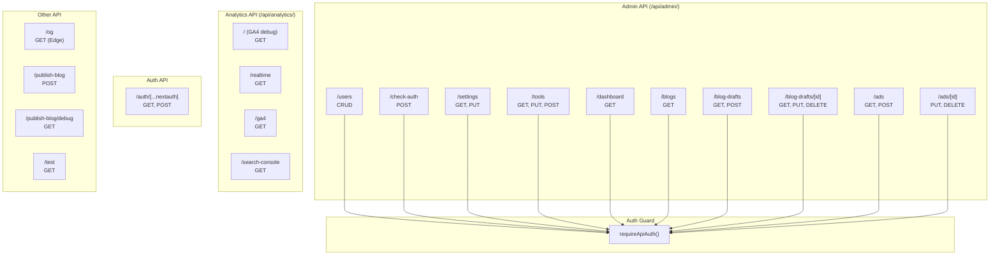

# API Architecture

## Overview

ToolForge uses **Next.js API Routes** (Route Handlers) for all server-side operations. There are **19 route files** across **15 endpoint groups**. All admin API routes are protected by `requireApiAuth()` which validates the Auth.js JWT session and admin role.

**Base URL:** `/api/` (deployed as Vercel Serverless Functions)

---

## API Route Map



---

## Admin API

### `POST /api/admin/check-auth`

Validate admin email and auto-create super admin if not exists.

| Field | Value |
|-------|-------|
| **Purpose** | Validates email belongs to active admin; creates super admin on first run |
| **Auth** | None (called before admin session is established) |
| **Request Body** | `{ email: string }` |
| **Response** | `{ role: string, isAdmin: boolean, user?: AdminUser }` |
| **Side Effects** | Updates `lastLogin` timestamp; creates super admin if missing |

---

### `GET /api/admin/users`
### `POST /api/admin/users`
### `PUT /api/admin/users`
### `DELETE /api/admin/users`

Full CRUD for admin user management.

| Method | Purpose | Request | Response |
|--------|---------|---------|----------|
| **GET** | List all admin users | — | `AdminUser[]` sorted by email |
| **POST** | Invite/create admin | `{ email, role }` | Upserted `AdminUser` |
| **PUT** | Update role/status | `{ email, role?, status? }` | Updated `AdminUser` |
| **DELETE** | Remove admin | `{ email }` | `{ success: true }` |

**Protected:** Super admin (`edwinwamukoya88@gmail.com`) cannot be demoted or deleted.

---

### `GET /api/admin/dashboard`

Aggregated dashboard statistics.

| Field | Value |
|-------|-------|
| **Response** | `{ blogPosts: number, publishedTools: number, users: number, drafts: number, activeUsers: null, sessions: null, pageViews: null, ... }` |
| **Data Sources** | Prisma (BlogDraft count, AdminUser count, ToolConfig count), blog.ts (published posts), analytics (null placeholders) |

---

### `GET /api/admin/settings`
### `PUT /api/admin/settings`

Site settings singleton CRUD.

| Method | Purpose | Request | Response |
|--------|---------|---------|----------|
| **GET** | Retrieve settings | — | `SiteSettings` (creates default if missing) |
| **PUT** | Update settings | Partial `SiteSettings` | Updated `SiteSettings` |

---

### `GET /api/admin/tools`
### `PUT /api/admin/tools`
### `POST /api/admin/tools`

Tool configuration flag management.

| Method | Purpose | Request | Response |
|--------|---------|---------|----------|
| **GET** | List all tools with config | — | `{ tools: ToolWithConfig[], categories: string[] }` |
| **PUT** | Update single tool config | `{ slug, updates: { enabled?, featured?, popular?, new? } }` | Updated `ToolConfig` |
| **POST** | Bulk update tools | `{ slugs: string[], updates: { ... } }` | Count of updated records |

---

### `GET /api/admin/blogs`

Published blog list with AI scores.

| Field | Value |
|-------|-------|
| **Response** | `{ slug, title, description, category, date, aiScore, internalLinks, aiBadge }[]` |
| **Data Sources** | blog.ts (MDX files) + ai-score.ts (AI visibility computation) |

---

### `GET /api/admin/blog-drafts`
### `POST /api/admin/blog-drafts`

Blog draft collection operations.

| Method | Purpose | Request | Response |
|--------|---------|---------|----------|
| **GET** | List all drafts | — | `BlogDraft[]` sorted by updatedAt desc |
| **POST** | Create new draft | `{ title, slug, description?, content?, category?, tags?, author?, featured?, coverImage?, status?, scheduledDate? }` | Created `BlogDraft` |

---

### `GET /api/admin/blog-drafts/[id]`
### `PUT /api/admin/blog-drafts/[id]`
### `DELETE /api/admin/blog-drafts/[id]`

Single blog draft operations.

| Method | Purpose | Response |
|--------|---------|----------|
| **GET** | Fetch draft by ID | `BlogDraft` or 404 |
| **PUT** | Partial update draft | Updated `BlogDraft` |
| **DELETE** | Delete draft | `{ success: true }` |

**Parameters:** `id` (string) — Draft ID from URL path.

---

### `GET /api/admin/ads`
### `POST /api/admin/ads`

Sponsored ad collection.

| Method | Purpose | Request | Response |
|--------|---------|---------|----------|
| **GET** | List all ads | — | `SponsoredAd[]` sorted by createdAt desc |
| **POST** | Create new ad | `{ title, link, description?, image?, slot?, active? }` | Created `SponsoredAd` |

---

### `PUT /api/admin/ads/[id]`
### `DELETE /api/admin/ads/[id]`

Single sponsored ad operations.

| Method | Purpose | Response |
|--------|---------|----------|
| **PUT** | Partial update ad | Updated `SponsoredAd` |
| **DELETE** | Delete ad | `{ success: true }` |

**Parameters:** `id` (string) — Ad ID from URL path.

---

## Analytics API

### `GET /api/analytics`

GA4 debug/fetch endpoint.

| Field | Value |
|-------|-------|
| **Purpose** | Run a GA4 report for last 7 days (pagePath × screenPageViews) |
| **Response** | Raw GA4 API response with detailed error reporting (stack traces in dev) |
| **Runtime** | Node.js |

---

### `GET /api/analytics/realtime`

GA4 real-time data.

| Field | Value |
|-------|-------|
| **Purpose** | Fetch active users and page views in real-time |
| **Dimensions** | `unifiedScreenName`, `country` |
| **Metrics** | `activeUsers`, `screenPageViews` |
| **Auth** | OAuth2 JWT bearer (self-signed JWT assertion) |
| **Runtime** | Node.js |

---

### `GET /api/analytics/ga4`

Parametrized GA4 data query.

| Field | Value |
|-------|-------|
| **Query Params** | `range` (today/yesterday/last7/last30/last90), `start`/`end` (custom), `metrics` (comma-separated), `dimensions` (comma-separated) |
| **Response** | Raw GA4 report rows |
| **Runtime** | Node.js |

---

### `GET /api/analytics/search-console`

Google Search Console data.

| Field | Value |
|-------|-------|
| **Query Params** | `start`, `end`, `dimensions` (default: query), `limit` (default: 20) |
| **Response** | Rows with keys, clicks, impressions, CTR, position |
| **Auth** | OAuth2 JWT bearer (same GA credentials) |
| **Runtime** | Node.js |

---

## Auth API

### `GET|POST /api/auth/[...nextauth]`

Catch-all NextAuth.js route handler. Delegates to shared auth configuration.

| Field | Value |
|-------|-------|
| **Provider** | Google OAuth |
| **Session** | JWT strategy |
| **Callbacks** | `signIn` validates admin email via `isAdmin()` |
| **Endpoints** | `/api/auth/signin`, `/api/auth/callback/google`, `/api/auth/session`, `/api/auth/signout`, etc. |
| **Runtime** | Node.js |

---

## Other API

### `GET /api/og`

Dynamic Open Graph image generator.

| Field | Value |
|-------|-------|
| **Purpose** | Generate 1200×630 PNG for social media previews |
| **Query Params** | `title` (default: "ToolForge Blog"), `category` (default: "Guide") |
| **Response** | PNG image (ImageResponse) |
| **Runtime** | **Edge** |

### `GET /api/test`

Health check endpoint.

| Field | Value |
|-------|-------|
| **Response** | `{ status: "working" }` |
| **Runtime** | Node.js |

### `POST /api/publish-blog`

Publish blog post to GitHub.

| Field | Value |
|-------|-------|
| **Purpose** | Commit MDX file to GitHub repository via Contents API |
| **Request** | `{ slug, content, title, description, tags, skipValidation?, skipAutoFix? }` |
| **Actions** | SEO auto-fix, pre-publish validation, GitHub commit, revalidation webhook, Google ping |
| **Runtime** | Node.js |

### `GET /api/publish-blog/debug`

GitHub publisher debug endpoint.

| Field | Value |
|-------|-------|
| **Purpose** | Debug GitHub configuration and API access |
| **Response** | Environment variable states and GitHub API verification result |
| **Runtime** | Node.js |

---

## Authentication Flow for API Routes

```mermaid
sequenceDiagram
    Client->>API Route: HTTP Request
    API Route->>requireApiAuth(): Validate
    requireApiAuth()->>NextAuth: auth() (read JWT cookie)
    NextAuth-->>requireApiAuth(): Session or null
    alt No Session
        requireApiAuth()->>Client: 401 { error: "Unauthorized" }
    else Invalid Role
        requireApiAuth()->>Client: 403 { error: "Forbidden" }
    else Valid
        requireApiAuth()-->>API Route: Session with user
        API Route->>Prisma/GA4/GitHub: Execute operation
        API Route->>Client: 200 JSON Response
    end
```

---

## Data Source Authentication

### GA4 & Search Console

Both use OAuth2 JWT bearer authentication with self-signed JWT assertions:

```typescript
const jwt = jsonwebtoken.sign(
  {
    iss: GA_CLIENT_EMAIL,
    scope: "https://www.googleapis.com/auth/webmasters.readonly",
    aud: "https://oauth2.googleapis.com/token",
    iat: Math.floor(Date.now() / 1000),
    exp: Math.floor(Date.now() / 1000) + 3600,
  },
  GA_PRIVATE_KEY,
  { algorithm: "RS256" }
)
```

**Required environment variables:** `GA_CLIENT_EMAIL`, `GA_PRIVATE_KEY`, `GA_PROPERTY_ID`

### GitHub

**Required environment variables:** `GITHUB_TOKEN`, `GITHUB_OWNER`, `GITHUB_REPO`
