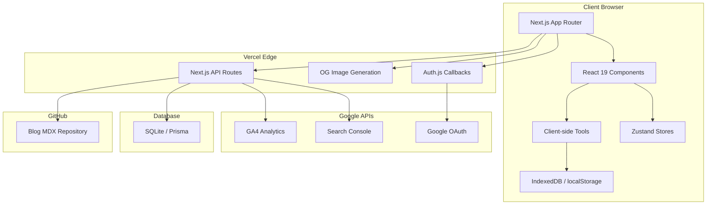
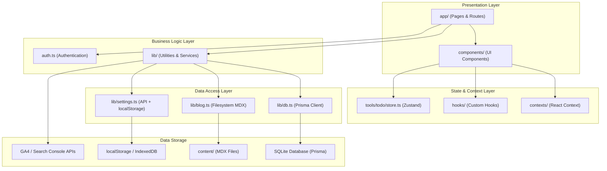
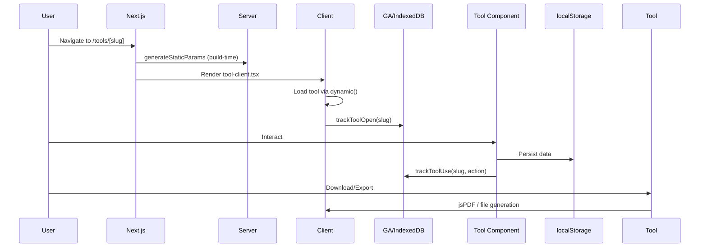
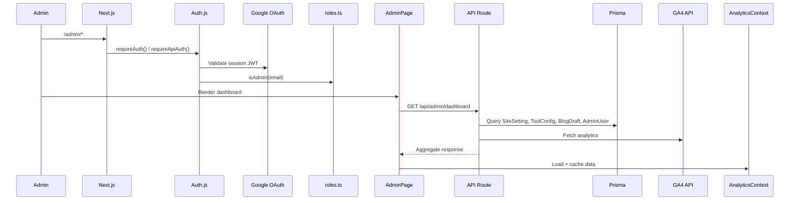
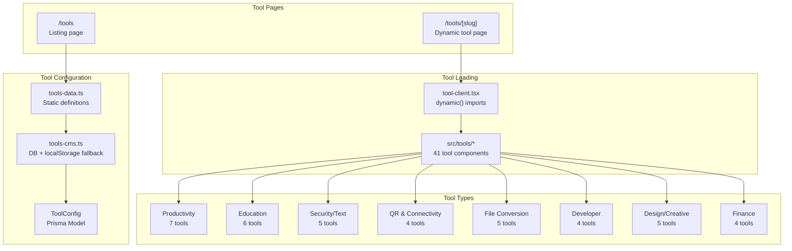
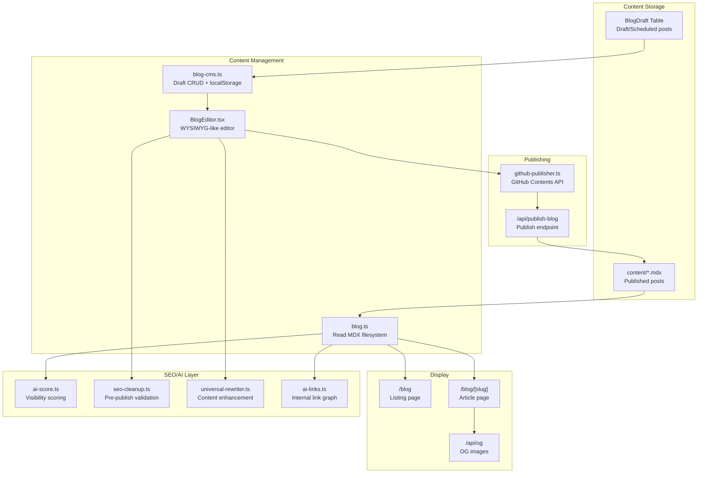
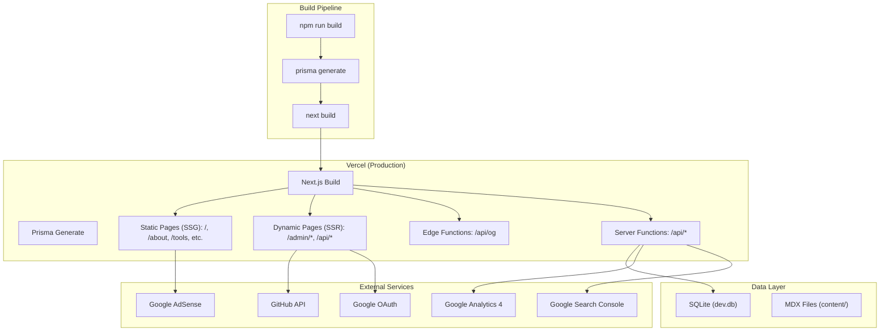
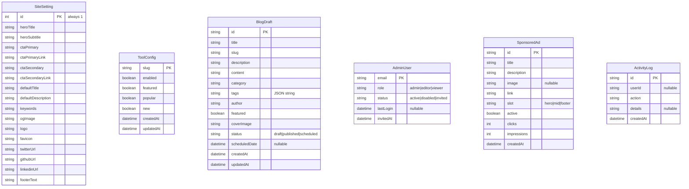
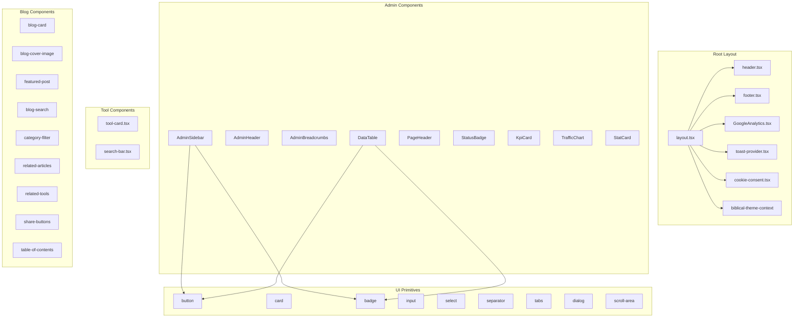
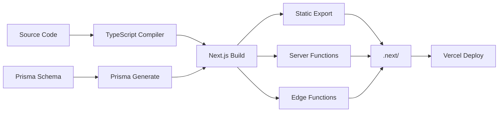

# ToolForge Architecture

## Executive Summary

ToolForge (project name: `toolpix`) is a privacy-first, client-side web application that provides 40+ free online tools for teachers, students, creators, developers, and businesses. Built with Next.js 16 (App Router) and React 19, it uses SQLite via Prisma ORM for data persistence, Auth.js v5 for Google OAuth authentication, and Tailwind CSS v4 for styling. The application is deployed on Vercel.

**Key principles:**
- Privacy-first: All tool processing happens client-side; no data leaves the user's device
- No login required for public tools; authentication only for admin panel
- Multi-source analytics: GA4 + Google Search Console + first-party IndexedDB tracking
- Blog content stored as MDX files with Prisma-backed draft management
- Tool visibility/feature flags managed via database with static fallback

---

## High-Level Architecture



---

## Technology Stack

| Category | Technology | Version |
|----------|-----------|---------|
| **Framework** | Next.js | 16.2.9 |
| **UI Library** | React | 19.2.4 |
| **Language** | TypeScript | 5.x |
| **Styling** | Tailwind CSS | 4.x |
| **Database** | SQLite (via Prisma) | Prisma 7.8.0 + better-sqlite3 12.11.1 |
| **Auth** | Auth.js (NextAuth) | 5.0.0-beta.31 |
| **State Management** | Zustand | 5.0.14 |
| **Animation** | Framer Motion | 12.42.0 |
| **Icons** | Lucide React | 1.18.0 |
| **Charts** | Recharts | 3.8.1 |
| **Markdown** | react-markdown + remark-gfm | 10.1.0 |
| **PDF** | jsPDF + jspdf-autotable | 4.2.1 |
| **Notifications** | Sonner | 2.0.7 |
| **Deployment** | Vercel | - |
| **Linting** | ESLint 9 + eslint-config-next | 16.2.9 |
| **Package Manager** | npm | - |

---

## Folder Organization

```
smart tools kit/
├── prisma/              # Database schema, migrations, seed
├── public/              # Static assets
├── content/             # Blog MDX files
├── src/
│   ├── app/             # Next.js App Router pages & API routes
│   │   ├── admin/       # Admin panel pages
│   │   ├── api/         # API route handlers
│   │   ├── blog/        # Public blog pages
│   │   ├── tools/       # Tool listing & dynamic tool pages
│   │   └── ...          # Static pages (about, contact, privacy, etc.)
│   ├── components/      # React components
│   │   ├── ui/          # shadcn-style primitives
│   │   ├── admin/       # Admin dashboard components
│   │   ├── ads/         # Ad display components
│   │   ├── blog/        # Blog UI components
│   │   ├── planner/     # Lesson planner wizard components
│   │   ├── pomodoro/    # Pomodoro timer analytics components
│   │   └── zenith/      # Zenith focus mode components
│   ├── contexts/        # React context providers
│   ├── hooks/           # Custom React hooks
│   ├── lib/             # Utility libraries & business logic
│   └── tools/           # Individual tool components (40+)
│       └── todo/        # Task planner subsystem (Zustand)
├── docs/                # Architecture documentation
├── next.config.js       # Next.js configuration
├── eslint.config.mjs    # ESLint configuration
├── prisma.config.ts     # Prisma configuration
└── components.json      # shadcn/ui configuration
```

---

## Application Layers



### 1. Presentation Layer
- **Pages** (`src/app/`): 11 public pages, 10 admin pages, 19 API routes
- **Components** (`src/components/`): 91 React components across 9 subdirectories
- **Tools** (`src/tools/`): 41 tool components with dynamic lazy-loading

### 2. State & Context Layer
- **AnalyticsContext**: Central state for analytics dashboard data
- **BiblicalThemeContext**: Theme toggling (biblical mode, calm mode)
- **Zustand Store**: Task planner state with localStorage persistence
- **Custom Hooks**: `useLocalStorage`, `useMounted`

### 3. Business Logic Layer
- **Auth**: Google OAuth via Auth.js v5 with admin email validation
- **Analytics Service**: Multi-source data aggregation with caching
- **Blog CMS**: Draft CRUD + MDX filesystem publishing
- **SEO Tools**: Content optimization, AI scoring, link analysis
- **Planner Utils**: CBC lesson plan generation with KICD compliance

### 4. Data Access Layer
- **Prisma Client**: Singleton SQLite connection with Better-SQLite3 adapter
- **Blog Reader**: MDX filesystem parser using gray-matter
- **Settings/User/Tools CMS**: API-first with localStorage fallback
- **GitHub Publisher**: Blog deployment via GitHub Contents API

---

## Data Flow

### Tool Usage Flow


### Admin Panel Data Flow


---

## Authentication Flow

```mermaid
sequenceDiagram
    User->>/api/auth/signin: Sign in with Google
    Auth.js->>Google: Redirect to OAuth consent
    Google-->>Auth.js: Authorization code
    Auth.js->>Google: Exchange for tokens
    Auth.js->>signIn callback: Verify email
    signIn callback->>roles.ts: isAdmin(email)
    roles.ts-->>signIn: true/false
    signIn-->>Auth.js: Allow/Deny
    Auth.js-->>User: JWT session cookie
    User->>/admin/*: Request admin page
    auth-guard.ts->>auth(): Read session
    auth()->>Auth.js: Validate JWT
    auth-guard.ts->>roles.ts: checkAdminRole(email)
    roles.ts-->>auth-guard.ts: Role or null
    auth-guard.ts-->>User: Allow or redirect
```

**Key details:**
- Provider: Google OAuth only
- Session strategy: JWT (no database sessions)
- Admin check: `isAdmin()` compares against hardcoded `ADMIN_USERS` array in `roles.ts`
- Super admin: `edwinwamukoya88@gmail.com` (role protected from deletion/demotion)
- Auto-creation: First admin (`edwinwamukoya88@gmail.com`) auto-created on check-auth if missing

---

## Analytics Flow

```mermaid
graph LR
    subgraph "Client-Side"
        A[User Action] --> B[ga.ts / analytics.ts]
        B --> C[Google Analytics 4 (gtag)]
        B --> D[first-party-analytics.ts]
        D --> E[IndexedDB]
    end

    subgraph "Server-Side (Admin)"
        F[Admin Dashboard] --> G[analytics-context.tsx]
        G --> H[analytics-service.ts]
        H --> I[GET /api/analytics/*]
        I --> J[GA4 Data API]
        I --> K[Search Console API]
        H --> L[first-party-analytics.ts]
        L --> E
    end
```

**Three analytics sources:**
1. **GA4**: Events tracked via gtag (`G-W75ZWVJVFB`), queried via `@google-analytics/data`
2. **First-Party**: IndexedDB-based privacy-first tracking (tool usage, page views, sessions)
3. **Search Console**: SEO data via Google Webmasters API

**Alert system:** `alerts.ts` evaluates metric thresholds and generates push-style alerts.

---

## Admin System

The admin panel at `/admin/*` provides:

| Page | Route | Purpose |
|------|-------|---------|
| Dashboard | `/admin` | Overview stats, quick actions, system health |
| Blog | `/admin/blog` | List/manage published posts + drafts |
| Blog Editor | `/admin/blog/new` | Create new blog post |
| Blog Editor | `/admin/blog/[id]/edit` | Edit existing draft |
| Tools | `/admin/tools` | Manage tool visibility flags |
| Tool Detail | `/admin/tools/[id]` | Tool-specific settings + analytics |
| Ads | `/admin/ads` | Sponsored ad management |
| AI Studio | `/admin/ai` | AI content tools (simulated) |
| Analytics | `/admin/analytics` | Full analytics dashboard (8 tabs) |
| Settings | `/admin/settings` | Site-wide branding & SEO settings |
| Users | `/admin/users` | Admin user management |
| System | `/admin/system` | System health checks |

**Access control:**
- `requireAuth()` (server) / `requireApiAuth()` (API) validates session
- Roles: `admin`, `editor`, `viewer`

---

## Tool System



---

## Blog/CMS System



---

## Deployment Architecture



---

## Prisma Architecture



**No explicit relations between models.** All 6 models are standalone. Foreign key logic is handled at the application layer.

---

## Component Architecture



---

## Build Process



**Build command:** `prisma generate && next build`

**Output:**
- Static pages (SSG): Pre-rendered at build time
- Dynamic pages (SSR): Rendered on request
- API routes: Deployed as serverless functions
- Edge routes (`/api/og`): Deployed at edge

---

## Next.js Architecture

| Feature | Implementation |
|---------|---------------|
| **Router** | App Router (file-system based) |
| **Rendering** | Mixed: SSG (tools, blog), SSR (admin), Static (public pages) |
| **Data Fetching** | Server Components + API Routes + Server Actions |
| **Dynamic Imports** | `next/dynamic` for tool components |
| **Metadata** | `generateMetadata()` + static `metadata` exports |
| **Sitemap** | Dynamic `/sitemap.xml` via `sitemap.ts` |
| **Font Optimization** | `next/font/google` (Geist, Geist Mono) |
| **Image Optimization** | `next/image` (limited usage; most images use `` for external sources) |
| **Strict Mode** | Enabled (`reactStrictMode: true`) |
| **TypeScript** | Strict mode enabled |
| **Path Aliases** | `@/*` maps to `./src/*` |
