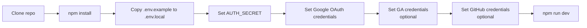
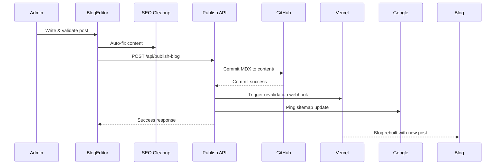

# Build and Deployment

## Prerequisites

| Requirement | Version | Notes |
|------------|---------|-------|
| **Node.js** | >= 18.x | Required for Next.js 16 |
| **npm** | >= 9.x | Comes with Node.js |
| **Git** | >= 2.x | Required for blog publishing via GitHub API |
| **Prisma** | 7.8.0 | Bundled as devDependency |
| **SQLite** | 3.x | Built into better-sqlite3 package |

### Verify Prerequisites

```bash
node --version   # Expected: v18.x or higher
npm --version    # Expected: 9.x or higher
git --version    # Expected: 2.x or higher
```

---

## Environment Variables

Create a `.env.local` file from the template:

```env
# Database (SQLite path)
DATABASE_URL="file:./dev.db"

# NextAuth.js v5 (Google OAuth)
AUTH_SECRET="<generate with: npx auth secret>"
AUTH_GOOGLE_ID="<Google OAuth client ID>"
AUTH_GOOGLE_SECRET="<Google OAuth client secret>"
AUTH_URL="http://localhost:3000"  # or production URL

# Google Analytics 4 API
GA_CLIENT_EMAIL="<GA service account email>"
GA_PRIVATE_KEY="<GA service account private key>"
GA_PROPERTY_ID="<GA4 property ID>"

# GitHub API (for blog publishing)
GITHUB_TOKEN="<GitHub personal access token>"
GITHUB_OWNER="<GitHub username/org>"
GITHUB_REPO="<GitHub repository name>"
GITHUB_BRANCH="main"

# Google AdSense (public, in layout.tsx)
# Ad client: ca-pub-2606064008386995
```

---

## npm Scripts

```json
{
  "dev": "next dev",
  "build": "prisma generate && next build",
  "start": "next start",
  "lint": "eslint ."
}
```

| Command | Purpose |
|---------|---------|
| `npm run dev` | Start development server with Turbopack |
| `npm run build` | Generate Prisma client + production build |
| `npm start` | Start production server |
| `npm run lint` | Run ESLint across all source files |
| `npx prisma studio` | Open Prisma Studio (database GUI) |
| `npx prisma migrate dev` | Create and apply new migration |
| `npx prisma seed` | Run seed script |
| `npx tsx prisma/seed.ts` | Run seed script (alternative) |

---

## Build Pipeline

```mermaid
graph LR
    A["npm run build"] --> B["1. prisma generate"]
    B --> C["Prisma Client<br/>generated to<br/>src/generated/prisma/"]
    C --> D["2. next build"]
    D --> E[Turbopack<br/>Production Compilation]
    E --> F[TypeScript<br/>Type Checking]
    F --> G[Static Page<br/>Generation (SSG)]
    G --> H[Server Functions<br/>Bundle]
    H --> I[Edge Functions<br/>Bundle]
    I --> J[.next/ output]
    J --> K[Deploy to Vercel]
```

### Step 1: Prisma Generate
- Reads `prisma/schema.prisma`
- Generates TypeScript client at `src/generated/prisma/`
- Creates type-safe database client

### Step 2: Next Build
- **Turbopack** for compilation (default in Next.js 16)
- **TypeScript** type checking
- **Static Generation**: `/tools/[slug]`, `/blog/[slug]`, `/about`, `/privacy`, `/terms`, `/contact`, `/help`
- **Server Components**: `/admin/*`
- **API Routes**: Deployed as serverless functions
- **Edge Routes**: `/api/og`

---

## ESLint Configuration

```javascript
// eslint.config.mjs
import { defineConfig, globalIgnores } from "eslint/config"
import next from "eslint-config-next"

export default defineConfig([
  next,
  globalIgnores([".next/**", "out/**", "build/**", "next-env.d.ts"]),
])
```

- Uses `eslint-config-next` 16.2.9 (Next.js canonical ESLint config)
- Ignores `.next/`, `out/`, `build/`, `next-env.d.ts`
- **Current status:** 0 errors, 32 warnings (auto-generated Prisma files, `no-img-element`, `exhaustive-deps` in animation loops)

---

## TypeScript Configuration

```json
{
  "compilerOptions": {
    "target": "ES2017",
    "lib": ["dom", "dom.iterable", "esnext"],
    "strict": true,
    "module": "esnext",
    "moduleResolution": "bundler",
    "jsx": "react-jsx",
    "paths": { "@/*": ["./src/*"] }
  },
  "include": ["next-env.d.ts", "**/*.ts", "**/*.tsx"],
  "exclude": ["node_modules"]
}
```

**Key settings:**
- `strict: true` — Maximum type safety
- `paths: { "@/*": ["./src/*"] }` — Path alias for clean imports
- `moduleResolution: "bundler"` — Modern resolution for Next.js

---

## Next.js Configuration

```javascript
// next.config.js
const nextConfig = {
  reactStrictMode: true,
}
module.exports = nextConfig
```

Minimal configuration — Next.js 16 sensible defaults.

---

## Vercel Configuration

```json
// vercel.json
{
  "version": 2,
  "buildCommand": "prisma generate && next build",
  "outputDirectory": ".next",
  "installCommand": "npm install"
}
```

---

## Deployment (Vercel)

### Production Deployment
The project is configured for Vercel deployment. The build process:

1. Vercel installs dependencies (`npm install`)
2. Runs `prisma generate` (generates Prisma client)
3. Runs `next build` (compiles, type checks, generates static pages)
4. Deploys output to Vercel's global edge network

### Environment Variables Required in Vercel

| Variable | Purpose |
|----------|---------|
| `DATABASE_URL` | SQLite database path |
| `AUTH_SECRET` | Auth.js encryption secret |
| `AUTH_GOOGLE_ID` | Google OAuth client ID |
| `AUTH_GOOGLE_SECRET` | Google OAuth client secret |
| `AUTH_URL` | Deployment URL |
| `GA_CLIENT_EMAIL` | GA4 service account email |
| `GA_PRIVATE_KEY` | GA4 service account private key |
| `GA_PROPERTY_ID` | GA4 property ID |
| `GITHUB_TOKEN` | GitHub API token |
| `GITHUB_OWNER` | GitHub owner |
| `GITHUB_REPO` | GitHub repo |

**Note:** SQLite (`dev.db`) and the `content/` directory containing blog MDX files (13 published posts) are included in the deployment. For production, consider using a managed database and external storage for blog content.

### Environment Setup Checklist



---

## Authentication Configuration

Auth.js v5 with Google OAuth provider:

```typescript
// auth.ts
export const { handlers, signIn, signOut, auth } = NextAuth({
  providers: [Google({ clientId, clientSecret })],
  session: { strategy: "jwt" },
  callbacks: {
    signIn({ user, account, profile }) {
      if (account?.provider !== "google") return false
      return isAdmin(user.email ?? profile?.email)
    },
  },
})
```

**Session strategy:** JWT (no database sessions required)
**Admin validation:** Synchronous check against hardcoded `ADMIN_USERS` array

---

## Blog Publishing Pipeline



---

## Troubleshooting

### Build Failures

| Symptom | Cause | Solution |
|---------|-------|----------|
| `PrismaClientValidationError` | Schema/client mismatch | Run `npx prisma generate` |
| `Module not found: @/generated/prisma/...` | Missing generated client | Run `npm run build` (includes `prisma generate`) |
| `TypeError: Cannot read properties of undefined` | Missing env vars | Check `.env.local` has all required variables |
| `Error: Cannot find module 'better-sqlite3'` | Native module not built | Run `npm rebuild better-sqlite3` |
| `ESLint: 45+ errors` | Stale lint cache | Run `npm run lint` (errors should be 0) |

### Database Issues

```bash
# Regenerate Prisma client
npx prisma generate

# Reset database (drops all data)
npx prisma migrate reset

# Open database GUI
npx prisma studio
```

### Authentication Issues

```bash
# Generate a new Auth.js secret
npx auth secret

# Verify Google OAuth is configured
echo "AUTH_GOOGLE_ID=$AUTH_GOOGLE_ID"
echo "AUTH_GOOGLE_SECRET=${AUTH_GOOGLE_SECRET:0:5}..."

# Check callback URL (must match Google Cloud Console)
# Expected: http://localhost:3000/api/auth/callback/google
```

### Blog Publishing Issues

```bash
# Check GitHub environment
curl -H "Authorization: token $GITHUB_TOKEN" "https://api.github.com/user"

# Verify the publisher debug endpoint
curl http://localhost:3000/api/publish-blog/debug
```

---

## Build Verification

After running `npm run build`, verify:

1. **Exit code 0** — Build completed successfully
2. **Prisma generation** — `✔ Generated Prisma Client` in output
3. **TypeScript** — `✓ Compiled successfully` or type check passes
4. **Static pages** — `● (SSG)` entries in the route summary
5. **No ESLint errors** — Run `npm run lint` to verify (expected: 0 errors)

### Build Output Structure

```
.next/
├── server/          # Server-side bundles
│   ├── app/         # Server Components
│   └── pages/       # API routes
├── static/          # Static assets (JS, CSS)
│   ├── chunks/      # Code-split chunks
│   └── media/       # Optimized images
├── standalone/      # Self-contained output
└── build-manifest.json  # Build manifest
```

### Expected Build Output Sizes

| Category | Typical Size | Notes |
|----------|-------------|-------|
| Static pages (SSG) | ~5-10 KB each | Pre-rendered HTML |
| Tool chunks | ~10-200 KB each | Lazy-loaded via dynamic() |
| Admin bundles | ~200-500 KB | Analytics dashboard, charts |
| API routes | ~50-100 KB each | Serverless functions |
| Total (`.next/`) | ~50-100 MB | Includes all bundles |

---

## Performance & Optimization

| Area | Current State |
|------|---------------|
| **Rendering** | SSG for tools/blog pages, SSR for admin, Static for public pages |
| **Code Splitting** | `next/dynamic()` for all 41 tool components |
| **Font Optimization** | `next/font/google` (Geist, Geist Mono) |
| **Image Optimization** | Limited `next/image` usage; most use native `` for external sources |
| **Bundle Size** | Tools are individually lazy-loaded per route |
| **Caching** | Browser caching for static assets; Vercel CDN caching |

---

## Build Output

```mermaid
graph TB
    subgraph "Output (.next/)"
        STATIC[Static Pages<br/>Pre-rendered HTML]
        SSG[SSG Pages<br/>/tools/[slug], /blog/[slug]]
        SERVER[Server Functions<br/>API Routes]
        EDGE[Edge Functions<br/>OG Image]
        CLIENT[Client Bundles<br/>JS chunks]
    end

    subgraph "Vercel Deployment"
        CDN[CDN Cache<br/>Static + SSG]
        LF[Lambda Functions<br/>API + SSR]
        EF[Edge Functions<br/>OG Image]
    end

    STATIC --> CDN
    SSG --> CDN
    SERVER --> LF
    EDGE --> EF
    CLIENT --> CDN
```
