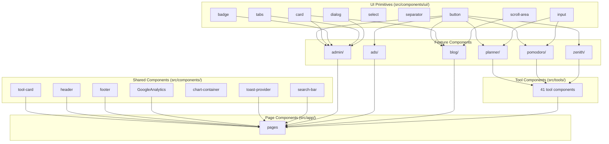
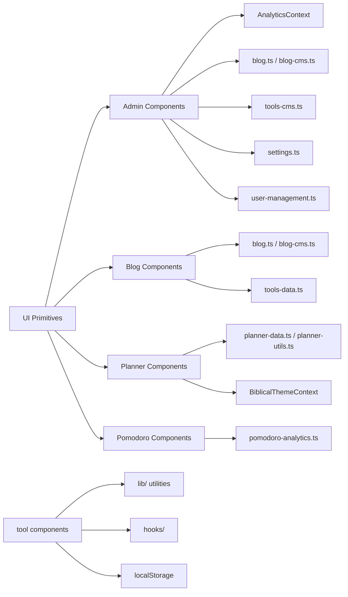

# Component Architecture

## Overview

The project contains **91 React component files** organized into 9 directories plus the root `components/` directory. Components follow a layered architecture: UI primitives → Feature components → Page components.

---

## Component Dependency Hierarchy



---

## UI Primitives (shadcn-style)

| Component | File | Props | Purpose |
|-----------|------|-------|---------|
| **Button** | `ui/button.tsx` | `variant`, `size`, `asChild` | Action button with variants (default, destructive, outline, secondary, ghost, link) |
| **Card** | `ui/card.tsx` | - | Card container with CardHeader, CardTitle, CardDescription, CardContent, CardFooter |
| **Badge** | `ui/badge.tsx` | `variant` | Small label with default/secondary/destructive/outline variants |
| **Input** | `ui/input.tsx` | standard input props | Text input with styling |
| **Select** | `ui/select.tsx` | standard select props | Dropdown select |
| **Separator** | `ui/separator.tsx` | - | Horizontal/vertical divider |
| **Tabs** | `ui/tabs.tsx` | `value`, `onValueChange` | Tabbed interface (TabsList, TabsTrigger, TabsContent) |
| **Dialog** | `ui/dialog.tsx` | `open`, `onOpenChange` | Modal dialog (DialogTrigger, DialogContent, DialogHeader, DialogTitle, DialogDescription) |
| **ScrollArea** | `ui/scroll-area.tsx` | - | Custom scrollable container |

---

## Shared Components

| Component | File | Purpose | Dependencies |
|-----------|------|---------|-------------|
| **Header** | `header.tsx` | Public site navigation (Logo, Tools, Blog, About, Admin link) | lucide-react, next/link |
| **Footer** | `footer.tsx` | Site footer (Product links, Legal, Social, CreatedBy) | next/link |
| **ToolCard** | `tool-card.tsx` | Tool card for directory grid (icon, name, description, badge) | next/link, lucide-react, Card |
| **SearchBar** | `search-bar.tsx` | Debounced search input with icon | lucide-react, Input |
| **ChartContainer** | `chart-container.tsx` | Recharts responsive container wrapper | recharts |
| **GoogleAnalytics** | `GoogleAnalytics.tsx` | GA4 route tracking + visibility engagement | @next/third-parties/google, next/navigation |
| **ToastProvider** | `toast-provider.tsx` | Sonner toast notification provider | sonner |

---

## Admin Components (26 components)

### Layout & Navigation
| Component | Purpose |
|-----------|---------|
| **AdminSidebar** | Left sidebar navigation for admin panel (nav_group structure) |
| **AdminHeader** | Top bar with search, notifications bell, user avatar/name |
| **AdminBreadcrumbs** | Breadcrumb navigation (Home / Parent / Current) |
| **PageHeader** | Page title with optional description and actions |
| **DashboardNavigation** | Tab navigation for analytics dashboard (8 tabs) |
| **DataSourceIndicator** | Data source status badges (GA4, Search Console, First-Party, Realtime) |

### Data Display
| Component | Purpose |
|-----------|---------|
| **DataTable** | Generic sortable table with columns, rows, conditional styling |
| **StatusBadge** | Colored status indicator (green/amber/red for active/warning/error) |
| **EmptyState** | Empty state display with icon, title, description, action |
| **ConfirmDialog** | Confirmation modal for destructive actions |

### Dashboard/Stats
| Component | Purpose |
|-----------|---------|
| **KpiCard** | KPI metric card (label, value, trend, sparkline) |
| **StatCard** | Simple stat card (icon, label, value) |
| **DashboardOverviewCards** | Grid of KPI cards for overview tab |
| **ProductAnalyticsCard** | Product-specific analytics card |

### Charts
| Component | Purpose |
|-----------|---------|
| **TrafficChart** | Time-series traffic line chart (BarChart) |
| **AcquisitionDonut** | Traffic sources pie chart (PieChart) |
| **CategoryBarChart** | Category performance bar chart |
| **ConversionFunnel** | Funnel visualization (BarChart) |
| **ToolFunnel** | Tool-specific funnel |

### Tables & Lists
| Component | Purpose |
|-----------|---------|
| **ToolPerformanceTable** | Per-tool metrics table |
| **ToolUsageChart** | Tool usage over time |
| **BlogAnalyticsSection** | Blog analytics summary |
| **BlogPerformanceTable** | Per-blog metrics table |
| **TrendingContent** | Trending content list |
| **SEODashboard** | SEO metrics dashboard |
| **SEOInspector** | SEO detail inspector |
| **SearchConsoleInsights** | Search Console data insights |
| **UserBehaviourHeatmap** | Day/hour user activity heatmap |
| **RecentActivityFeed** | Recent events feed |
| **LiveActivity** | Real-time user activity |
| **AIInsightsPanel** | AI-generated insights display |
| **RealtimeWidget** | Real-time data widget |

### Editor
| Component | Purpose |
|-----------|---------|
| **BlogEditor** | Blog post editor (title, content, metadata, cover config, SEO validation, publish) |

---

## Blog Components (9 components)

| Component | Purpose | Dependencies |
|-----------|---------|-------------|
| **BlogCard** | Blog post card for listing (image, title, date, category) | next/link, Card, Badge |
| **BlogCoverImage** | Blog cover image with gradient/pattern generation | |
| **BlogSearch** | Blog search input | Input |
| **CategoryFilter** | Blog category filter buttons | Button |
| **FeaturedPost** | Featured post hero display | Card, Badge, Button |
| **RelatedArticles** | Related blog posts grid | BlogCard |
| **RelatedTools** | Related tools links | Badge |
| **ShareButtons** | Social media share buttons (Twitter, Facebook, LinkedIn, Copy Link) | |
| **TableOfContents** | Sticky TOC generated from article headings | ScrollArea |

---

## Planner Components (12 components)

Part of the CBC Lesson Plan Generator 6-step wizard.

| Component | Step | Purpose |
|-----------|------|---------|
| **StepSetup** | 1 | Basic info (grade, learning area, strand, duration) |
| **StepCurriculum** | 2 | Learning outcomes, KEC, inquiry questions |
| **StepCompetencies** | 3 | Core competencies, values, PCIs, biblical integration |
| **StepActivities** | 4 | Teaching/learning activities, resources |
| **StepAssessment** | 5 | Assessment methods, remarks |
| **StepPreview** | 6 | Full plan preview + PDF export |
| **MultiSelect** | - | Multi-select chip input |
| **SearchableMultiSelect** | - | Searchable multi-select dropdown |
| **BiblicalReflection** | - | Bible verse suggestion and integration |
| **ComplianceMeter** | - | KICD compliance score (0-100%) |
| **LivePreview** | - | Real-time plan preview as user fills fields |
| **CustomFieldInput** | - | Custom field add/edit |

---

## Pomodoro Components (11 components)

Part of the Pomodoro Timer focus analytics system.

| Component | Purpose | Dependencies |
|-----------|---------|-------------|
| **AnimatedCounter** | Animated number display (value, duration, decimals) | |
| **CircularProgress** | SVG circular progress indicator | |
| **EmptyState** | Empty state for session history | |
| **GamificationCard** | XP, level, achievements display | Card, Badge |
| **HeatmapPreview** | 90-day session heatmap | |
| **InsightCard** | Individual AI insight card | Card |
| **InsightsDashboard** | Full insights dashboard with trends | Card, Badge, Tabs |
| **LoadingSkeleton** | Loading skeleton for analytics | Card |
| **SparklineChart** | Mini sparkline chart | recharts |
| **WeeklyMonthlyChart** | Weekly/monthly focus time comparison | recharts |
| **AIInsightsPanel** | AI-generated insights with tips | Card |

---

## Zenith Components (7 components)

Zenith is a themed focus timer experience with Pomodoro modes.

| Component | Purpose |
|-----------|---------|
| **Timer** | Main focus timer (pomodoro/short break/long break modes, keyboard shortcuts) |
| **Hero** | Animated hero section for Pomodoro tool page |
| **TaskOrganizer** | Inline task list during focus sessions |
| **AmbientSounds** | Background sound player (waveform visualization) |
| **QuoteDisplay** | Motivational quote display |
| **Analytics** | Focus session analytics summary |
| **SmartInsights** | AI-powered focus insights |

---

## Ad Components (3 components)

| Component | Purpose | Dependencies |
|-----------|---------|-------------|
| **AdSlot** | Ad slot dispatcher (sponsored/adsense types) | ad-banner |
| **AdBanner** | Sponsored ad banner renderer | |
| **CookieConsent** | GDPR cookie consent banner | |

---

## Hooks

| Hook | File | Signature | Purpose |
|------|------|-----------|---------|
| **useLocalStorage** | `hooks/use-local-storage.ts` | `<T>(key, initial) => [T, setter, loaded]` | Persistent state via localStorage with SSR safety |
| **useMounted** | `hooks/use-mounted.ts` | `() => boolean` | Returns true after hydration (SSR-safe) |

---

## Context Providers

| Provider | File | State | Purpose |
|----------|------|-------|---------|
| **AnalyticsProvider** | `contexts/analytics-context.tsx` | Full analytics state (KPIs, traffic, tools, SEO, alerts) | Central state for analytics dashboard |
| **BiblicalThemeProvider** | `contexts/biblical-theme-context.tsx` | biblicalMode, biblicalPerspective, calmMode | Theme CSS class toggling |

---

## Zustand Store (Task Planner)

Located at `tools/todo/store.ts`:

```typescript
interface TodoStore {
  todos: Todo[]
  filters: FilterState
  ui: UIState
  // Actions
  addTodo, updateTodo, deleteTodo, toggleTodo, ...etc
  // Computed selectors (via selectFilteredTodos, selectStats, etc.)
}
```

- Persisted to localStorage via Zustand `persist` middleware
- Includes v1→v2 data migration
- Separate selectors for filtered views, stats, calendar tasks, notifications

---

## Dependencies Between Major Component Groups


