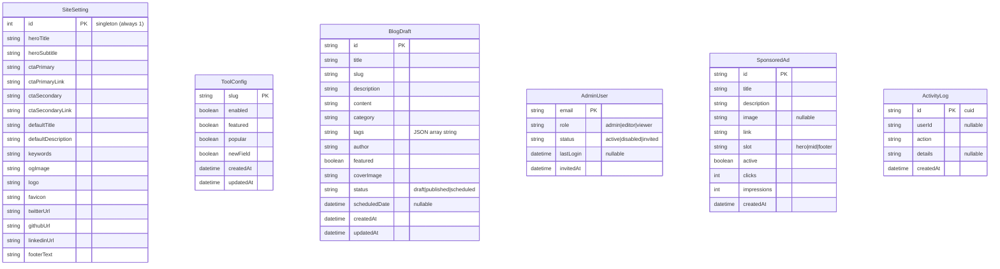
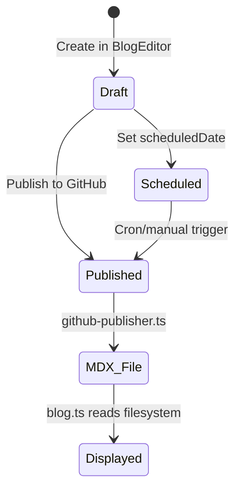

# Database Architecture

## Overview

Zilita uses **SQLite** as its database, accessed through **Prisma ORM** (v7.8.0) with the **Better-SQLite3** adapter. The database contains 6 models with no explicit foreign key relationships. Application-layer logic handles any cross-table operations.

**Database file:** `dev.db` (local development)

---

## Data Source Configuration

```typescript
// prisma.config.ts
export default defineConfig({
  schema: "prisma/schema.prisma",
  migrations: { path: "prisma/migrations" },
  datasource: { url: process.env["DATABASE_URL"] },
})
```

---

## Prisma Client Singleton

```typescript
// lib/db.ts
import { PrismaClient } from "@/generated/prisma/client"
import { PrismaBetterSQLite3 } from "@prisma/adapter-better-sqlite3"

const globalForPrisma = globalThis as unknown as { prisma: PrismaClient }
const adapter = new PrismaBetterSQLite3(require("better-sqlite3")(dbPath))

export const prisma = globalForPrisma.prisma ?? new PrismaClient({ adapter })
if (process.env.NODE_ENV !== "production") globalForPrisma.prisma = prisma
```

---

## Entity Relationship Diagram



---

## Models Detail

### SiteSetting (Singleton)

A single-row configuration table (always `id: 1`) for site-wide branding and SEO settings.

| Field | Type | Default |
|-------|------|---------|
| id | Int (PK) | `1` |
| heroTitle | String | "Smart Tools for Productivity & CBC Education" |
| heroSubtitle | String | "Free, privacy-first utilities..." |
| ctaPrimary | String | "Explore Tools" |
| ctaPrimaryLink | String | "/tools" |
| ctaSecondary | String | "Read Blog" |
| ctaSecondaryLink | String | "/blog" |
| defaultTitle | String | "Zilita — Smart Tools..." |
| defaultDescription | String | "Free online tools..." |
| keywords | String | "productivity tools, cbc tools..." |
| ogImage | String | "/og-image.png" |
| logo | String | "/logo.png" |
| favicon | String | "/favicon.ico" |
| twitterUrl | String | "https://twitter.com/Zilita" |
| githubUrl | String | "https://github.com/edwinwamukoya88-alt" |
| linkedinUrl | String | "https://linkedin.com" |
| footerText | String | "(c) 2026 Zilita. All rights reserved." |

### ToolConfig

Configuration flags for each tool, separate from static definition data.

| Field | Type | Default | Description |
|-------|------|---------|-------------|
| slug | String (PK) | — | Tool identifier (matches tools-data.ts slug) |
| enabled | Boolean | true | Whether tool is visible to users |
| featured | Boolean | false | Featured tool badge |
| popular | Boolean | false | Popular tool badge |
| new | Boolean | false | New tool badge |
| createdAt | DateTime | now() | — |
| updatedAt | DateTime | updatedAt | — |

### BlogDraft

Stores blog posts in draft or scheduled status. Published posts are stored as MDX files.

| Field | Type | Default | Description |
|-------|------|---------|-------------|
| id | String (PK) | — | UUID-like identifier |
| title | String | — | Post title |
| slug | String | — | URL slug |
| description | String | "" | Meta description |
| content | String | "" | MDX content body |
| category | String | "Uncategorized" | Blog category |
| tags | String | "[]" | JSON array as string |
| author | String | "Zilita Team" | Author name |
| featured | Boolean | false | Featured post flag |
| coverImage | String | "" | Cover image URL/config |
| status | String | "draft" | `draft`, `published`, or `scheduled` |
| scheduledDate | DateTime? | null | Scheduled publish date |
| createdAt | DateTime | now() | — |
| updatedAt | DateTime | updatedAt | — |

### AdminUser

Registry of authorized admin panel users.

| Field | Type | Default | Description |
|-------|------|---------|-------------|
| email | String (PK) | — | User email (also auth identifier) |
| role | String | "viewer" | `admin`, `editor`, or `viewer` |
| status | String | "active" | `active`, `disabled`, or `invited` |
| lastLogin | DateTime? | null | Last successful login timestamp |
| invitedAt | DateTime | now() | Invitation timestamp |

### SponsoredAd

Managed advertisements with click/impression tracking.

| Field | Type | Default | Description |
|-------|------|---------|-------------|
| id | String (PK) | — | UUID-like identifier |
| title | String | — | Ad title |
| description | String | "" | Ad description |
| image | String? | null | Image URL |
| link | String | — | Destination URL |
| slot | String | "hero" | Placement: `hero`, `mid`, or `footer` |
| active | Boolean | true | Whether ad is active |
| clicks | Int | 0 | Click counter |
| impressions | Int | 0 | Impression counter |
| createdAt | DateTime | now() | — |

### ActivityLog

Generic audit trail for admin actions.

| Field | Type | Default | Description |
|-------|------|---------|-------------|
| id | String (PK) | auto | Auto-generated cuid |
| userId | String? | null | Acting user identifier |
| action | String | — | Action description |
| details | String? | null | Additional context |
| createdAt | DateTime | now() | — |

---

## Relationships

There are **no explicit relationships** defined in the Prisma schema. All cross-table operations are handled at the application layer. The models are conceptually related as follows:

```mermaid
graph TB
    subgraph "Content"
        BD[BlogDraft]
        MDX[content/*.mdx<br/>Published posts]
    end

    subgraph "Configuration"
        SS[SiteSetting<br/>singleton]
        TC[ToolConfig<br/>per-tool flags]
    end

    subgraph "Users & Auth"
        AU[AdminUser]
        AL[ActivityLog]
    end

    subgraph "Monetization"
        SA[SponsoredAd]
    end

    AU --> AL  "Application layer: log admin actions"
```

---

## Data Flow: Blog Storage



**Two storage systems for blog content:**
1. **Draft/Scheduled** → `BlogDraft` Prisma table
2. **Published** → `content/*.mdx` files on disk

---

## Seed Data

The seed script (`prisma/seed.ts`) populates:

1. **SiteSetting** — Single row with all defaults
2. **AdminUser** — Super admin `edwinwamukoya88@gmail.com` (role: admin, status: active)
3. **ToolConfig** — 40 tool slugs (all enabled, not featured/popular/new)

---

## Migrations

**Single migration:** `20260701152259_init` — Creates all 6 tables with the schema described above.

---

## Data Access Patterns

### Read Paths
- **Site settings**: `lib/settings.ts` → API route → Prisma → Singleton row
- **Tool config**: `lib/tools-cms.ts` → API route → Prisma → ToolConfig table
- **Blog drafts**: `lib/blog-cms.ts` → API route → Prisma → BlogDraft table
- **Admin users**: `lib/user-management.ts` → API route → Prisma → AdminUser table
- **Published blogs**: `lib/blog.ts` → Filesystem → `content/*.mdx`
- **Dashboard stats**: API route → Prisma (multiple counts) + GA4 API

### Write Paths
- All writes go through API routes with `requireApiAuth()` guard
- Each lib module has localStorage fallback for resilience
- No direct Prisma client usage outside API routes
