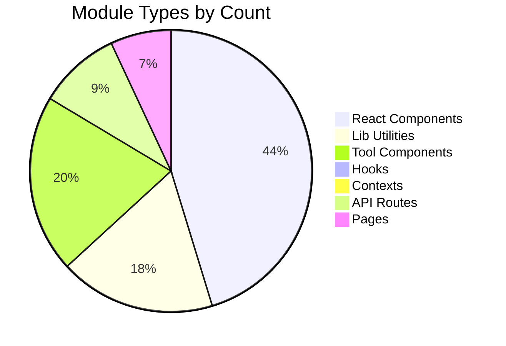

# Dependency Map

## External Packages

### Core
| Package | Version | Used In | Purpose |
|---------|---------|---------|---------|
| `next` | 16.2.9 | All pages & API routes | React framework with App Router |
| `react` / `react-dom` | 19.2.4 | All components | UI library |

### UI & Styling
| Package | Version | Used In | Purpose |
|---------|---------|---------|---------|
| `tailwindcss` | 4 | `globals.css` | Utility-first CSS framework |
| `@tailwindcss/postcss` | 4 | `postcss.config.mjs` | Tailwind PostCSS plugin |
| `tailwindcss-animate` | 1.0.7 | `globals.css` | Tailwind animation utilities |
| `tw-animate-css` | 1.4.0 | Styling | Animation classes |
| `class-variance-authority` | 0.7.1 | `ui/button.tsx`, `ui/badge.tsx` | Component variant management |
| `clsx` | 2.1.1 | `lib/utils.ts` | Conditional class merging |
| `tailwind-merge` | 3.6.0 | `lib/utils.ts` | Tailwind class conflict resolution |

### Icons & Animation
| Package | Version | Used In | Purpose |
|---------|---------|---------|---------|
| `lucide-react` | 1.18.0 | Most components | Icon library |
| `framer-motion` | 12.42.0 | `pomodoro.tsx`, `zenith/*`, `planner/*` | Animations & transitions |

### Database
| Package | Version | Used In | Purpose |
|---------|---------|---------|---------|
| `@prisma/client` | 7.8.0 | `lib/db.ts` | Database ORM |
| `@prisma/adapter-better-sqlite3` | 7.8.0 | `lib/db.ts` | SQLite adapter |
| `better-sqlite3` | 12.11.1 | `lib/db.ts` | SQLite driver |
| `prisma` (dev) | 7.8.0 | CLI | Schema management, migrations, seed |

### Auth
| Package | Version | Used In | Purpose |
|---------|---------|---------|---------|
| `next-auth` | 5.0.0-beta.31 | `auth.ts`, `api/auth/[...nextauth]` | Authentication framework |
| `@next/third-parties` | 16.2.9 | `GoogleAnalytics.tsx` | Google Analytics integration |

### Analytics
| Package | Version | Used In | Purpose |
|---------|---------|---------|---------|
| `@google-analytics/data` | 6.1.0 | `api/analytics/*` | GA4 Data API client |
| `recharts` | 3.8.1 | `admin/*` charts, `pomodoro/*` charts | Charting library |

### Content & Markdown
| Package | Version | Used In | Purpose |
|---------|---------|---------|---------|
| `react-markdown` | 10.1.0 | `blog-article-client.tsx` | Markdown rendering |
| `remark-gfm` | 4.0.1 | `blog-article-client.tsx` | GitHub Flavored Markdown |
| `rehype-highlight` | 7.0.2 | `blog-article-client.tsx` | Code syntax highlighting |
| `rehype-raw` | 7.0.0 | `blog-article-client.tsx` | Raw HTML in markdown |
| `gray-matter` | 4.0.3 | `lib/blog.ts` | Frontmatter parsing |

### PDF & File
| Package | Version | Used In | Purpose |
|---------|---------|---------|---------|
| `jspdf` | 4.2.1 | `lib/planner-utils.ts`, `lib/export-utils.ts`, `pdf-converter` | PDF generation |
| `jspdf-autotable` | 5.0.8 | `lib/planner-utils.ts` | PDF table plugin |
| `mammoth` | 1.12.0 | `document-converter` | DOCX conversion |
| `@ffmpeg/ffmpeg` | 0.12.10 | `audio-converter` | Audio conversion |

### QR Code
| Package | Version | Used In | Purpose |
|---------|---------|---------|---------|
| `qrcode` | 1.5.4 | `qr-generator` | QR code generation |
| `@types/qrcode` (dev) | 1.5.6 | TypeScript types | QR code type definitions |

### State Management
| Package | Version | Used In | Purpose |
|---------|---------|---------|---------|
| `zustand` | 5.0.14 | `tools/todo/store.ts` | State management with persist |

### Other
| Package | Version | Used In | Purpose |
|---------|---------|---------|---------|
| `sonner` | 2.0.7 | `toast-provider.tsx`, `ReminderSystem.tsx` | Toast notifications |
| `@base-ui/react` | 1.5.0 | Potential future use | Base UI components |
| `wavesurfer.js` | 7.12.8 | `zenith/ambient-sounds.tsx` | Audio waveform visualization |

### Dev Dependencies
| Package | Version | Used In | Purpose |
|---------|---------|---------|---------|
| `eslint` | 9 | CLI | Linting |
| `eslint-config-next` | 16.2.9 | `eslint.config.mjs` | Next.js ESLint config |
| `typescript` | 5 | All `.ts`/`.tsx` files | Type checking |
| `tsx` | 4 | `prisma/seed.ts` | TypeScript execution |
| `@types/react` | 19 | TypeScript | React type definitions |
| `@types/react-dom` | 19 | TypeScript | React DOM type definitions |
| `@types/node` | 20 | TypeScript | Node.js type definitions |

---

## Internal Module Dependencies

```mermaid
graph TB
    subgraph "Entry Points"
        AUTH[auth.ts]
        ROOT[app/layout.tsx]
        HOME[app/page.tsx]
        ADMIN[app/admin/*]
        TOOL_PAGE[app/tools/[slug]/*]
    end

    subgraph "Auth Layer"
        ROLES[lib/roles.ts]
        AUTH_GUARD[lib/auth-guard.ts]
        USER_MGMT[lib/user-management.ts]
    end

    subgraph "Data Layer"
        DB[lib/db.ts]
        SETTINGS[lib/settings.ts]
        SETTINGS_TYPES[lib/settings-types.ts]
        TOOLS_DATA[lib/tools-data.ts]
        TOOLS_CMS[lib/tools-cms.ts]
        BLOG[lib/blog.ts]
        BLOG_CMS[lib/blog-cms.ts]
        BLOG_TYPES[lib/blog-types.ts]
    end

    subgraph "Analytics Layer"
        GA[lib/ga.ts]
        ANALYTICS[lib/analytics.ts]
        ANALYTICS_SVC[lib/analytics-service.ts]
        ANALYTICS_UTILS[lib/analytics-utils.ts]
        FP_ANALYTICS[lib/first-party-analytics.ts]
        ALERTS[lib/alerts.ts]
        GA4_MOCK[lib/ga4-mock.ts]
        CTRX[contexts/analytics-context.tsx]
    end

    subgraph "Planner Layer"
        PL_TYPES[lib/planner-types.ts]
        PL_DATA[lib/planner-data.ts]
        PL_UTILS[lib/planner-utils.ts]
    end

    subgraph "Pomodoro Layer"
        POM_ANALYTICS[lib/pomodoro-analytics.ts]
    end

    subgraph "SEO/AI Layer"
        AI_SCORE[lib/ai-score.ts]
        AI_BADGE[lib/ai-badge.ts]
        AI_LINKS[lib/ai-links.ts]
        AI_META[lib/ai-meta.ts]
        AI_SIGNALS[lib/ai-signals.ts]
        SEO[lib/seo-cleanup.ts]
        REWRITER[lib/universal-rewriter.ts]
        SEO_TRACKER[lib/universal-seo-tracker.ts]
        TRENDS[lib/universal-trends.ts]
        COVER[lib/blog-cover-generator.ts]
    end

    subgraph "Publishing Layer"
        ENV[lib/env.ts]
        GH_PUB[lib/github-publisher.ts]
        EXPORT[lib/export-utils.ts]
    end

    subgraph "Utilities"
        UTILS[lib/utils.ts]
    end

    subgraph "Hooks"
        USE_LS[hooks/use-local-storage.ts]
        USE_MOUNTED[hooks/use-mounted.ts]
    end

    %% Auth dependencies
    AUTH_GUARD --> AUTH
    AUTH_GUARD --> ROLES
    ROLES -.-> AUTH
    USER_MGMT --> AUTH

    %% Data dependencies
    BLOG --> BLOG_TYPES
    BLOG --> AI_SCORE
    BLOG --> AI_META
    BLOG --> AI_LINKS
    BLOG --> AI_SIGNALS
    BLOG --> COVER
    BLOG_CMS --> BLOG_TYPES
    SETTINGS --> SETTINGS_TYPES
    TOOLS_CMS --> TOOLS_DATA

    %% Analytics dependencies
    ANALYTICS --> GA
    ANALYTICS_SVC --> ANALYTICS_UTILS
    ANALYTICS_SVC --> FP_ANALYTICS
    CTRX --> ANALYTICS_SVC
    CTRX --> ALERTS
    ALERTS --> UTILS

    %% Planner dependencies
    PL_UTILS --> PL_TYPES
    PL_UTILS --> PL_DATA

    %% SEO/AI dependencies
    REWRITER --> AI_SCORE
    REWRITER --> AI_LINKS
    REWRITER --> AI_META
    REWRITER --> TOOLS_DATA
    COVER --> BLOG_TYPES

    %% Publishing dependencies
    GH_PUB --> ENV
    EXPORT --> UTILS

    %% Shared utility
    ALL_MODULES --> UTILS

    %% Hooks
    USE_LS --> UTILS
```

---

## Data Flow Dependencies

### Page → Library Dependencies

| Page/Component | Libraries Used |
|---------------|----------------|
| `app/page.tsx` (Home) | `lib/tools-data.ts`, `lib/blog.ts` |
| `app/tools/[slug]/tool-client.tsx` | `lib/tools-data.ts`, `lib/analytics.ts`, `lib/ga.ts` |
| `app/blog/[slug]/page.tsx` | `lib/blog.ts` |
| `app/admin/page.tsx` (Dashboard) | `lib/auth-guard.ts`, `lib/db.ts`, `lib/blog.ts` |
| `app/admin/analytics/page.tsx` | `contexts/analytics-context.tsx` |
| `app/admin/blog/page.tsx` | `lib/blog.ts`, `lib/blog-cms.ts` |
| `app/admin/tools/page.tsx` | `lib/tools-cms.ts` |
| `app/admin/settings/page.tsx` | `lib/settings.ts` |
| `app/admin/users/page.tsx` | `lib/user-management.ts` |
| `app/admin/ai/page.tsx` | `lib/seo-cleanup.ts`, `lib/universal-rewriter.ts` |

### Component → Library Dependencies

| Component | Libraries Used |
|-----------|----------------|
| `components/tool-card.tsx` | `lib/tools-data.ts` |
| `components/GoogleAnalytics.tsx` | `lib/ga.ts` |
| `components/admin/BlogEditor.tsx` | `lib/blog-cms.ts` |
| `components/planner/*` | `lib/planner-data.ts`, `lib/planner-utils.ts`, `lib/planner-types.ts` |
| `components/pomodoro/*` | `lib/pomodoro-analytics.ts` |
| `components/zenith/*` | `lib/pomodoro-analytics.ts` |
| `components/admin/*` (analytics) | `contexts/analytics-context.tsx` |

---

## Shared Utilities

### `lib/utils.ts` (Core utilities)

Used by virtually every component:

```typescript
// Available everywhere via "@/"
import { cn, generateId, debounce, formatDate } from "@/lib/utils"
```

- `cn(...inputs)` — Tailwind class merging (uses `clsx` + `tailwind-merge`)
- `generateId()` — UUID generation
- `debounce(fn, ms)` — Debounced function wrapper
- `formatDate(dateString, style?)` — Date formatting

### `hooks/use-local-storage.ts`

Used by tools that persist state:

```typescript
// Pattern: state persistence with SSR safety
const [value, setValue, loaded] = useLocalStorage<T>("key", initialValue)
```

### `hooks/use-mounted.ts`

Used for hydration-safe effects:

```typescript
const mounted = useMounted()
if (!mounted) return null // Avoid SSR mismatch
```

---

## Circular Dependency Check

The project has **no circular dependencies**. The dependency graph is a DAG (Directed Acyclic Graph):

- `lib/*` files depend only on other `lib/*` files or external packages
- `components/*` depend on `lib/*` and `contexts/*`
- `contexts/*` depend on `lib/*`
- `hooks/*` depend only on React
- `app/*` depend on `components/*`, `lib/*`, `contexts/*`

---

## Module Dependency by Category


