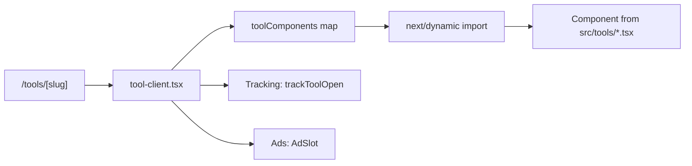

# Tools Catalog

## Overview

ToolForge ships **41 tools** across **8 categories**. All tools are client-side only (no data leaves the user's device), lazy-loaded via `next/dynamic()`, and require no authentication.

---

## How Tools Are Loaded



The dynamic import map in `tool-client.tsx`:

```typescript
const toolComponents: Record<string, ComponentType> = {
  planner: dynamic(() => import("@/tools/todo-list")),
  pomodoro: dynamic(() => import("@/tools/pomodoro")),
  notes: dynamic(() => import("@/tools/notes-app")),
  // ... one entry per slug
}
```

**Alias:** `/tools/todo` resolves to `/tools/planner`

---

## Productivity Tools (8 tools)

### Task Planner
| Field | Value |
|-------|-------|
| **Slug** | `planner` (alias: `todo`) |
| **Page** | `/tools/planner` |
| **Component** | `TaskPlanner` via `todo-list.tsx` |
| **Description** | Organize tasks, reminders, calendars, and productivity workflows in a powerful privacy-first planner. |
| **Subsystem** | `tools/todo/` (Zustand store, 8 sub-components) |
| **Storage** | localStorage via Zustand persist |

### Pomodoro Timer
| Field | Value |
|-------|-------|
| **Slug** | `pomodoro` |
| **Page** | `/tools/pomodoro` |
| **Component** | `PomodoroTimer` via `pomodoro.tsx` |
| **Description** | Stay focused with customizable timers. Features Zenith focus mode, session analytics, gamification. |
| **Dependencies** | `components/zenith/*` (7 components), `components/pomodoro/*` (11 components), `lib/pomodoro-analytics.ts` |
| **Storage** | localStorage |

### Notes App
| Field | Value |
|-------|-------|
| **Slug** | `notes` |
| **Page** | `/tools/notes` |
| **Component** | `NotesApp` via `notes-app.tsx` |
| **Description** | Write and organize notes with local storage. |
| **Storage** | localStorage |

### Day Planner
| Field | Value |
|-------|-------|
| **Slug** | `day-planner` |
| **Page** | `/tools/day-planner` |
| **Component** | `DayPlanner` via `day-planner.tsx` |
| **Description** | Plan your day hour by hour. |

### Habit Tracker
| Field | Value |
|-------|-------|
| **Slug** | `habit-tracker` |
| **Page** | `/tools/habit-tracker` |
| **Component** | `HabitTracker` via `habit-tracker.tsx` |
| **Description** | Build daily streaks and track habits. |

### Stopwatch
| Field | Value |
|-------|-------|
| **Slug** | `stopwatch` |
| **Page** | `/tools/stopwatch` |
| **Component** | `Stopwatch` via `stopwatch.tsx` |
| **Description** | Track time with lap recording. |

### Kanban Board
| Field | Value |
|-------|-------|
| **Slug** | `kanban` |
| **Page** | `/tools/kanban` |
| **Component** | `KanbanBoard` via `kanban-board.tsx` |
| **Description** | Organize tasks with drag-and-drop boards. |

### Blog Generator
| Field | Value |
|-------|-------|
| **Slug** | `blog-generator` |
| **Page** | `/tools/blog-generator` |
| **Component** | `BlogGenerator` via `blog-generator.tsx` |
| **Description** | Generate SEO-optimized MDX blog posts instantly from a title. |

---

## Education & CBC Tools (6 tools)

### CBC Grade Calculator
| Field | Value |
|-------|-------|
| **Slug** | `grade-calculator` |
| **Page** | `/tools/grade-calculator` |
| **Component** | `GradeCalculator` via `grade-calculator.tsx` |
| **Description** | Calculate scores and competency levels (EE/ME/AE/BE) per KICD. |

### CBC Learning & Revision Planner
| Field | Value |
|-------|-------|
| **Slug** | `revision-planner` |
| **Page** | `/tools/revision-planner` |
| **Component** | `RevisionPlanner` via `revision-planner.tsx` |
| **Description** | Plan skill-based practice, projects, and competency reinforcement with structured curriculum mapping. |

### CBC Lesson Plan Generator
| Field | Value |
|-------|-------|
| **Slug** | `lesson-plan-generator` |
| **Page** | `/tools/lesson-plan-generator` |
| **Component** | `LessonPlanGenerator` via `lesson-plan-generator.tsx` |
| **Description** | Generate full KICD-compliant lesson plans with competencies and PCIs. |
| **Sub-components** | `components/planner/*` (12-step wizard) |
| **Data** | `lib/planner-data.ts` (massive curriculum dataset) |

### Exam/Task Generator
| Field | Value |
|-------|-------|
| **Slug** | `exam-generator` |
| **Page** | `/tools/exam-generator` |
| **Component** | `ExamGenerator` via `exam-generator.tsx` |
| **Description** | Generate performance-based assessments — projects, tasks, observations. |

### Teacher Comment Generator
| Field | Value |
|-------|-------|
| **Slug** | `teacher-comment-generator` |
| **Page** | `/tools/teacher-comment-generator` |
| **Component** | `TeacherCommentGenerator` via `teacher-comment-generator.tsx` |
| **Description** | Generate competency-based feedback aligned to CBC levels. |

### Scheme of Work Generator
| Field | Value |
|-------|-------|
| **Slug** | `scheme-of-work-generator` |
| **Page** | `/tools/scheme-of-work-generator` |
| **Component** | `SchemeOfWorkGenerator` via `scheme-of-work-generator.tsx` |
| **Description** | Create KICD schemes of work with inquiry questions and competencies. |

---

## Security & Text Tools (5 tools)

| Slug | Name | Description |
|------|------|-------------|
| `password-generator` | Password Generator | Generate strong, secure passwords |
| `text-cleaner` | Text Cleaner | Remove extra spaces and duplicate lines |
| `base64` | Base64 Encoder/Decoder | Encode and decode Base64 strings |
| `url-encoder` | URL Encoder/Decoder | Encode and decode URLs safely |
| `random-generator` | Random Generator | Generate random UUIDs, numbers, names |

---

## QR & Connectivity Tools (4 tools)

| Slug | Name | Description | Libraries |
|------|------|-------------|-----------|
| `qr-generator` | QR Code Generator | Generate QR codes from text or URLs | qrcode |
| `qr-scanner` | QR Code Scanner | Scan QR codes using your camera | Browser Camera API |
| `qr-extractor` | QR Code Extractor | Decode QR codes from images | jsQR |
| `url-shortener` | URL Shortener | Generate short URLs locally | - |

---

## File Conversion Tools (5 tools)

| Slug | Name | Description | Libraries |
|------|------|-------------|-----------|
| `pdf-converter` | PDF Converter | Convert files to and from PDF format | jsPDF |
| `image-converter` | Image Converter | Convert images between popular formats | Canvas API |
| `document-converter` | Document Converter | Convert documents between formats | mammoth |
| `audio-converter` | Audio Converter | Convert audio files between formats | @ffmpeg/ffmpeg |
| `file-compressor` | File Compressor | Compress and archive files | Compression Streams API |

---

## Developer Tools (4 tools)

| Slug | Name | Description |
|------|------|-------------|
| `json-formatter` | JSON Formatter | Format, validate, and beautify JSON |
| `regex-tester` | Regex Tester | Test regular expressions with live matching |
| `markdown-preview` | Markdown Preview | Write markdown and preview in real-time |
| `unit-converter` | Unit Converter | Convert length, weight, temperature, and more |

---

## Design & Creative Tools (5 tools)

### Color Picker
| Field | Value |
|-------|-------|
| **Slug** | `color-picker` |
| **File** | `color-picker.tsx` |
| **Description** | Pick, convert, and copy colors in HEX, RGB, HSL. |

### Lorem Ipsum Generator
| Field | Value |
|-------|-------|
| **Slug** | `lorem-ipsum` |
| **File** | `lorem-ipsum.tsx` |
| **Description** | Generate placeholder text for your designs. |

### Favicon Generator
| Field | Value |
|-------|-------|
| **Slug** | `favicon-generator` |
| **File** | `favicon-generator.tsx` |
| **Description** | Generate favicons from text or emoji. |

### Image Placeholder
| Field | Value |
|-------|-------|
| **Slug** | `image-placeholder` |
| **File** | `image-placeholder.tsx` |
| **Description** | Create custom sized placeholder images. |

### Design Cards Studio
| Field | Value |
|-------|-------|
| **Slug** | `design-cards-studio` |
| **Directory** | `design-cards-studio/` (7 files) |
| **Description** | Create business cards, wedding invites, event cards, social media posts, and certificates. |
| **Sub-components** | CardForm, CardPreview, ExportPanel, TemplateSelector + types, templates, utils |

---

## Finance Tools (4 tools)

| Slug | Name | Description |
|------|------|-------------|
| `currency-converter` | Currency Converter | Convert between world currencies (manual rates) |
| `loan-calculator` | Loan Calculator | Calculate loan payments and EMI schedules |
| `profit-calculator` | Profit Calculator | Calculate profit margins and ROI |
| `expense-tracker` | Expense Tracker | Track and analyze your monthly spending |

---

## Tool Subsystems

### Task Planner (`tools/todo/`)

A full-featured productivity system with 8 sub-components and Zustand state management:

| File | Component | Purpose |
|------|-----------|---------|
| `TaskPlanner.tsx` | TaskPlanner | Main view: groups tasks by time slot |
| `TaskForm.tsx` | TaskForm | Create/edit task dialog |
| `TaskFilters.tsx` | TaskFilters | Search, filter, sort, view toggle |
| `TaskCard.tsx` | TaskCard, PriorityBadge, CategoryBadge | Individual task display |
| `TaskDashboard.tsx` | TaskDashboard | Stats: totals, streaks, completion rate |
| `TaskCalendar.tsx` | CalendarDay, TaskCalendar | Month/week calendar view |
| `FocusMode.tsx` | FocusMode | Distraction-free task view |
| `ReminderSystem.tsx` | ReminderSystem | Browser notification reminders |

### Design Cards Studio (`tools/design-cards-studio/`)

| File | Component | Purpose |
|------|-----------|---------|
| `DesignCardsStudio.tsx` | DesignCardsStudio | Main studio layout |
| `CardForm.tsx` | CardForm | Card content editor |
| `CardPreview.tsx` | CardPreview | Live card preview |
| `ExportPanel.tsx` | ExportPanel | PNG/PDF export |
| `TemplateSelector.tsx` | TemplateSelector | Template gallery |
| `templates.ts` | — | Card template definitions |
| `cardTypes.ts` | — | TypeScript interfaces |
| `utils.ts` | — | Utility functions |

---

## Tools Quick Reference

| # | Category | Slug | Name | Component File |
|---|----------|------|------|---------------|
| 1 | Productivity | planner | Task Planner | `todo-list.tsx` + `todo/` |
| 2 | Productivity | pomodoro | Pomodoro Timer | `pomodoro.tsx` |
| 3 | Productivity | notes | Notes App | `notes-app.tsx` |
| 4 | Productivity | day-planner | Day Planner | `day-planner.tsx` |
| 5 | Productivity | habit-tracker | Habit Tracker | `habit-tracker.tsx` |
| 6 | Productivity | stopwatch | Stopwatch | `stopwatch.tsx` |
| 7 | Productivity | kanban | Kanban Board | `kanban-board.tsx` |
| 8 | Productivity | blog-generator | Blog Generator | `blog-generator.tsx` |
| 9 | Education | grade-calculator | CBC Grade Calculator | `grade-calculator.tsx` |
| 10 | Education | revision-planner | Revision Planner | `revision-planner.tsx` |
| 11 | Education | lesson-plan-generator | Lesson Plan Generator | `lesson-plan-generator.tsx` |
| 12 | Education | exam-generator | Exam Generator | `exam-generator.tsx` |
| 13 | Education | teacher-comment-generator | Teacher Comment Generator | `teacher-comment-generator.tsx` |
| 14 | Education | scheme-of-work-generator | Scheme of Work Generator | `scheme-of-work-generator.tsx` |
| 15 | Security & Text | password-generator | Password Generator | `password-generator.tsx` |
| 16 | Security & Text | text-cleaner | Text Cleaner | `text-cleaner.tsx` |
| 17 | Security & Text | base64 | Base64 Encoder/Decoder | `base64.tsx` |
| 18 | Security & Text | url-encoder | URL Encoder/Decoder | `url-encoder.tsx` |
| 19 | Security & Text | random-generator | Random Generator | `random-generator.tsx` |
| 20 | QR & Connectivity | qr-generator | QR Code Generator | `qr-generator.tsx` |
| 21 | QR & Connectivity | qr-scanner | QR Code Scanner | `qr-scanner.tsx` |
| 22 | QR & Connectivity | qr-extractor | QR Code Extractor | `qr-extractor.tsx` |
| 23 | QR & Connectivity | url-shortener | URL Shortener | `url-shortener.tsx` |
| 24 | File Conversion | pdf-converter | PDF Converter | `pdf-converter.tsx` |
| 25 | File Conversion | image-converter | Image Converter | `image-converter.tsx` |
| 26 | File Conversion | document-converter | Document Converter | `document-converter.tsx` |
| 27 | File Conversion | audio-converter | Audio Converter | `audio-converter.tsx` |
| 28 | File Conversion | file-compressor | File Compressor | `file-compressor.tsx` |
| 29 | Developer Tools | json-formatter | JSON Formatter | `json-formatter.tsx` |
| 30 | Developer Tools | regex-tester | Regex Tester | `regex-tester.tsx` |
| 31 | Developer Tools | markdown-preview | Markdown Preview | `markdown-preview.tsx` |
| 32 | Developer Tools | unit-converter | Unit Converter | `unit-converter.tsx` |
| 33 | Design & Creative | color-picker | Color Picker | `color-picker.tsx` |
| 34 | Design & Creative | lorem-ipsum | Lorem Ipsum Generator | `lorem-ipsum.tsx` |
| 35 | Design & Creative | favicon-generator | Favicon Generator | `favicon-generator.tsx` |
| 36 | Design & Creative | image-placeholder | Image Placeholder | `image-placeholder.tsx` |
| 37 | Design & Creative | design-cards-studio | Design Cards Studio | `design-cards-studio/` |
| 38 | Finance | currency-converter | Currency Converter | `currency-converter.tsx` |
| 39 | Finance | loan-calculator | Loan Calculator | `loan-calculator.tsx` |
| 40 | Finance | profit-calculator | Profit Calculator | `profit-calculator.tsx` |
| 41 | Finance | expense-tracker | Expense Tracker | `expense-tracker.tsx` |
